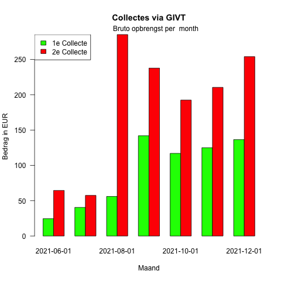
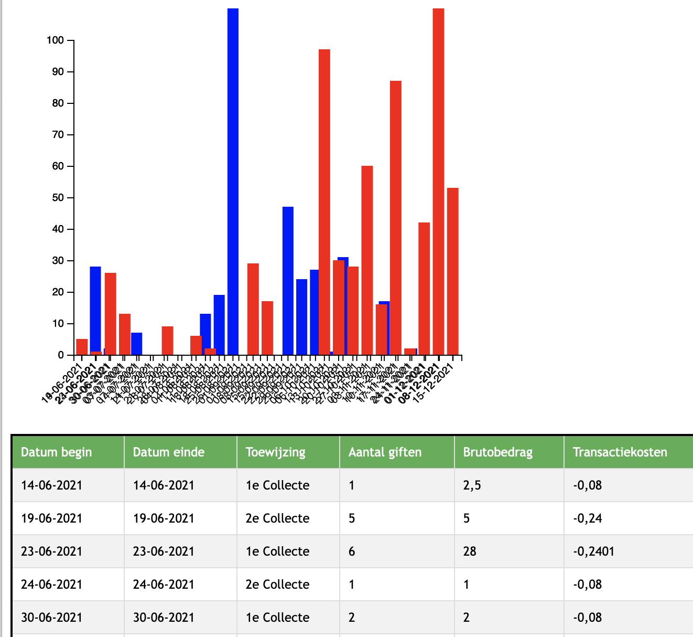

# R scripts for analyzing GIVT data

This repository contains some scripts to analyze data that is exported from the GIVT dashboard.

## Prerequisites

+ Install R from [The R project](https://www.r-project.org). 
+ Tested with version 4.1.2 on MacOS, 11-11-2021.
+ Download a sample .csv export from the [GIVT dashboard](https://cloud.givtapp.net/#/).
    + manually using the web console
    + or using [bash script](download.sh) that uses the GIVT API

## Contents

+ [givt-functions.r](givt-functions.r) contains library functions
+ [givt-sample.r](givt-sample.r) contains sample graph calls and menu to load the data

## Example usage

    echo sample.csv | Rscript givt-sample.r

## Advanced usage

Download the data. Make sure you change the script with the required time frame and change the givt-sample.r script with the right labels in stead of the dummy 1e Collecte and 2e Collecte.

    chmod u+x download.sh
    dep_username=xxxx dep_password=yyyy ./download.sh
    echo sample.csv | Rscript givt-sample.r

## Other options 

### JavaScript using data to make tables and graphs

It would be nice if GIVT would add more graphical reporting options in its dashboard. Several options are possible.
The [chart.html](chart.html) shows a simple table and a simple graph which can be used to show data based on the sample.csv export file.

